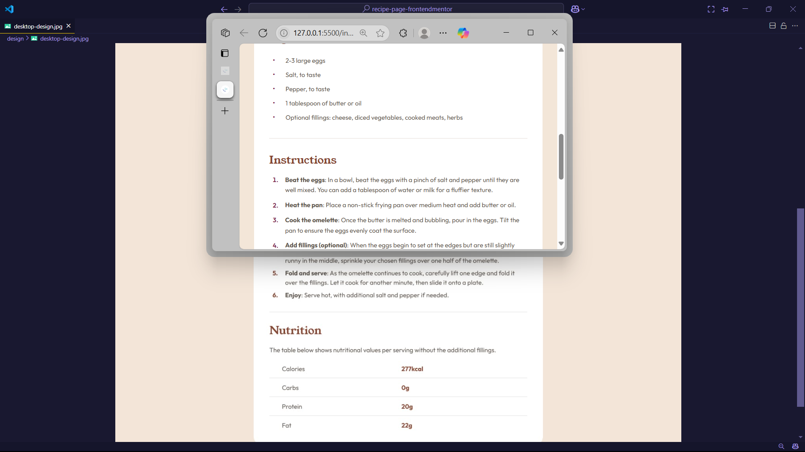

# Frontend Mentor - Recipe page solution

## Welcome! 👋

Thanks for checking out this front-end coding challenge.

This is a solution to the [Recipe page challenge on Frontend Mentor](https://www.frontendmentor.io/challenges/recipe-page-KiTsR8QQKm). Frontend Mentor challenges help you improve your coding skills by building realistic projects. 

## Table of contents

- [Overview](#overview)
  - [Screenshot](#screenshot)
  - [Links](#links)
- [My process](#my-process)
  - [Built with](#built-with)
  - [What I learned](#what-i-learned)
- [Author](#author)

## Overview

### Screenshot

### Links

- Solution URL: https://www.frontendmentor.io/solutions/mannex-recipe-page-solution-712IRuFvHg
- Live Site URL: https://mannex22.github.io/recipe-page-frontendmentor/

## My process

### Built with

- Semantic HTML5 markup
- CSS custom properties
- Flexbox
- CSS Grid

### What I learned

• I've learned how to make custom numbered/bullet points
• I've learned how to add space between bullet points and its text using
• I've learned how to use grid to align bullet points and its text
• I've learned how to use counter-reset and counter-increment

## Author

- Frontend Mentor - [@Mannex22](https://www.frontendmentor.io/profile/Mannex22)